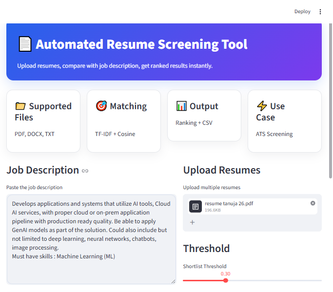
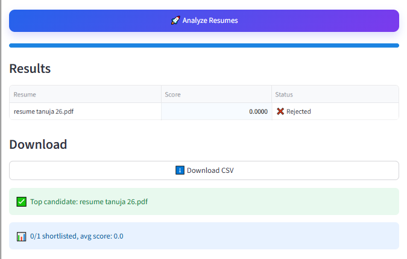
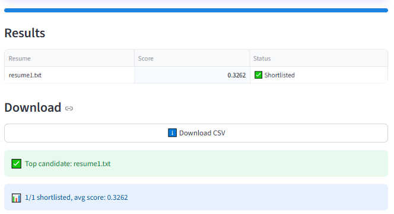

# 🧠 Automated Resume Screening Tool

## 📌 Overview
An AI-powered tool that screens resumes using NLP techniques and ranks candidates based on job description relevance.

---

## 🖥️ UI Preview

### 📌 Dashboard


### 📂 Resume Upload


### 📊 Results & Ranking


---

## 🚀 Features
- ✅ Resume parsing (PDF, DOCX, TXT)
- ✅ TF-IDF + Cosine Similarity matching
- ✅ Candidate ranking & scoring
- ✅ Automated shortlisting system
- ✅ Modern Streamlit dashboard
- ✅ CSV report download

---
## ⚙️ Tech Stack
- Python
- Pandas
- Scikit-learn
- Streamlit
- pdfplumber


---

## 📊 Output
| Feature | Description |
|---------|-------------|
| 📈 **Resume Scores** | TF-IDF similarity scores (0-1) |
| 🏆 **Ranked Candidates** | Top-to-bottom ranking |
| ✅ **Shortlist Decision** | Auto shortlist above threshold |
| ⬇️ **CSV Export** | Downloadable screening report |

---

## ▶️ Quick Start

```bash
# 1. Install dependencies
pip install -r requirements.txt

# 2. Run the app
streamlit run app.py
```

**Open:** `http://localhost:8501`

---

## 📚 Learning Outcomes
- **NLP Basics**: TF-IDF vectorization & cosine similarity
- **Resume Parsing**: PDF/DOCX/TXT text extraction
- **ATS Simulation**: Real-world resume screening workflow
- **UI Development**: Modern Streamlit dashboard design
- **Data Processing**: Pandas for ranking & reporting

---

## 🎯 Industry Relevance
**Perfect for roles in:**
- Python Development
- Data Analysis
- HR Technology
- AI/ML Engineering
- Automation Engineering

---

## 👩‍💻 Author
**Tanuja Solunke**  

